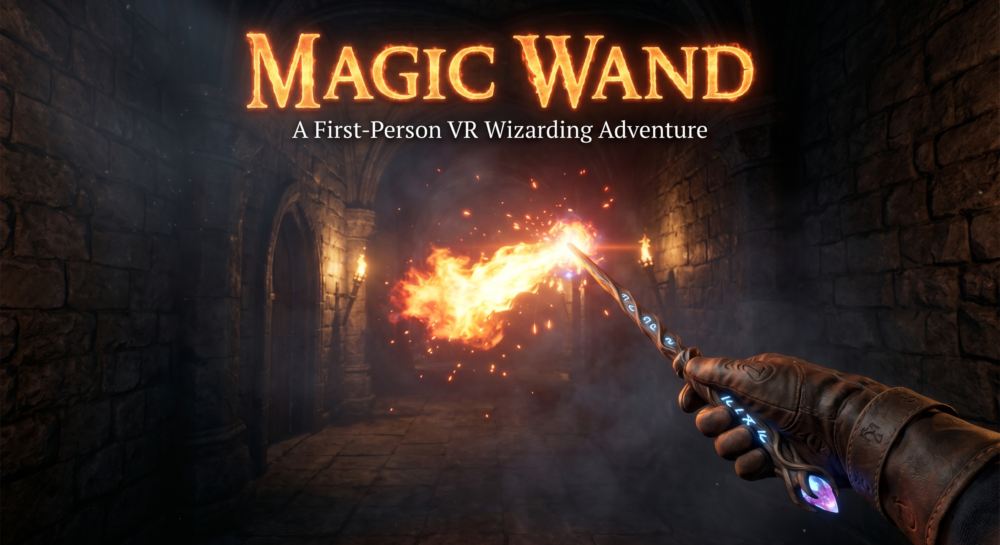
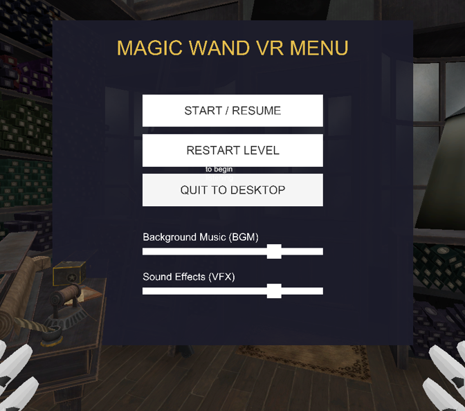

# 🪄 Magic Wand VR

An immersive, Harry Potter-themed Virtual Reality game built in Unity, featuring advanced hand physics and a voice-activated spellcasting system. Step into the shoes of a Hogwarts wizard, pick up your wand, and cast iconic spells using your actual voice!

---

## 🌟 Key Features

* **🗣️ Voice-Activated Spellcasting**: Powered by the **Meta Voice SDK (Wit.ai)**, the game uses advanced voice transcription and intent matching. Say spells out loud to summon fire, levitate furniture, open doors, and more!
* **🖐️ Physics-Based Hand Interaction**: Using the **AutoHand VR framework**, feel the weight and collision of objects. Pick up, hold, and swing wands naturally.
* **🏰 Iconic Hogwarts Locations**:
  * **Ollivanders Wand Shop**: An ancient, dusty shop stacked with wand boxes. Find the wand that chooses you!
  * **Gryffindor Common Room**: A warm, cozy space with fireplaces, armchairs, and interactive magical books and pots.
  * **Hogwarts Corridors**: Mysterious, gothic hallways with massive doors and torches.
  * **Transfiguration Classroom**: Test your magic skills on various classroom props.
* **🪄 Authentic Wands**: Choose between legendary wand replicas, including **Harry's Wand** and **Voldemort's Wand**.

---

## ⚡ Spellcasting Guide

Activate voice recognition (by pressing **F** on the keyboard in Editor mode, or the **A/B Controller Buttons** in VR) and speak one of the following spells:

| Spell | Voice Command Alternatives | Description / Effect |
| :--- | :--- | :--- |
| **Lumos** 💡 | `"lumos"`, `"lubos"` | Ignites a brilliant magical light source at the tip of your wand. |
| **Nox** 🌑 | `"nox"`, `"knox"`, `"light off"`, `"dark"` | Dispels the wand's magical light. |
| **Wingardium Leviosa** 🎈 | `"wingardium leviosa"`, `"leviosa"` | Levitates objects and furniture, causing them to float in the air. |
| **Descendo** ⬇️ | `"descendo"` | Brings levitated objects gently back to the ground. |
| **Alohomora** 🔑 | `"alohomora"`, `"aloha"` | Unlocks and opens massive wooden doors along the corridors. |
| **Incendio** 🔥 | `"incendio"`, `"in san diego"` | Casts a blazing, active wall of fire from your wand. |
| **Finite Incantatem** 🛑 | `"finite incantatem"`, `"finite"` | Resets all active magic, extinguishing fire, dropping objects, and closing doors. |
| **Great Hall** 🏛️ | `"great hall"`, `"grey hall"` | Teleports the player directly to the Great Hall level. |

---

## 📸 In-game Screenshots

Here is a look inside the magical world of **Magic Wand VR**:

### 🏰 Exploration & Environments
| **Ollivanders Wand Shop** | **Hogwarts Corridor** |
| :---: | :---: |
|  |  |

| **Gryffindor Common Room** | **Transfiguration Classroom** |
| :---: | :---: |
|  |  |

### 🔮 Magical Interactions & Items
| **Cauldron Potion Station** | **Voldemort's Wand Detail** |
| :---: | :---: |
|  |  |

| **Harry's Wand & Spell Casting** | **Spell Practice & Targets** |
| :---: | :---: |
|  |  |

| **Magical Snake Encounter** |
| :---: |
|  |

---

## 🛠️ Project Setup & Prerequisites

1. **Unity Version**: Recommended **Unity 2022.3 LTS** or higher.
2. **VR Hardware**: Meta Quest 2, Quest Pro, or Quest 3 (configured via Oculus Link or standalone build).
3. **Voice Recognition**: Configured via **Meta Voice SDK (Wit.ai)**. An active Client Access Token is required in the project's `wit.config` asset.
4. **Hand Physics**: Built using the **AutoHand** package. Ensure OpenXR loader is enabled in **XR Plug-in Management**.

---

*Made with 🪄 and code. Feel free to explore the repository and try casting your own spells!*
